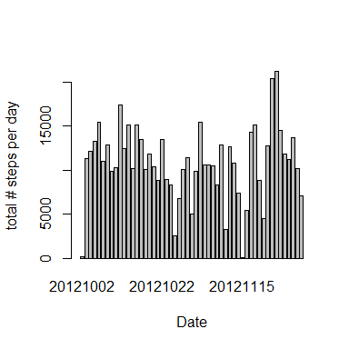
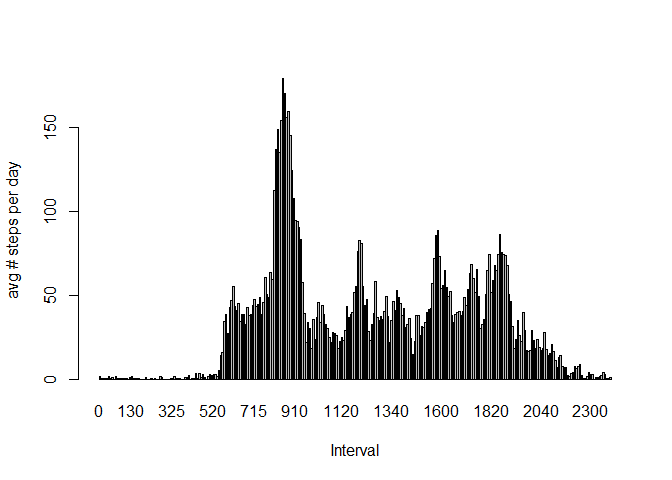
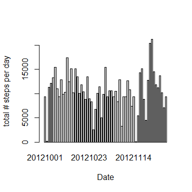
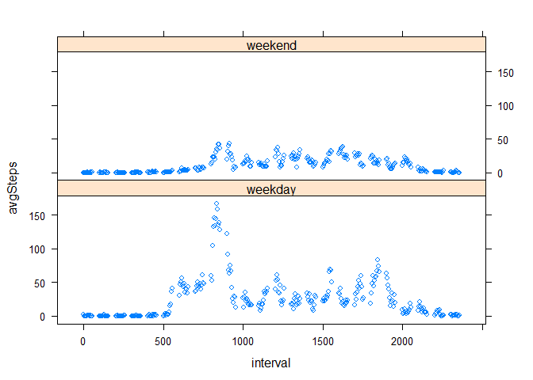

# Reproducible Research: Peer Assessment 1

```r
knitr::opts_chunk$set(echo = TRUE)
```

## Loading and preprocessing the data
loading file activity.csv into dataframe activity
QC: nr of observations should be 17568
Convert date to POSIXlt format (tmp)
create new date variable $dt that contains the measurement date in format yyyymmdd


```r
setwd("D:/gitdir/ReproducibleResearch/Project1/RepData_PeerAssessment1")
activity <- read.csv("D:/gitdir/ReproducibleResearch/Project1/RepData_PeerAssessment1/activity/activity.csv")
nrow(activity)
```

```
## [1] 17568
```

```r
activity$tmp <- strptime(activity$date,"%Y-%m-%d")
activity$dt <- format(activity$tmp,"%Y%m%d")
```


## What is mean total number of steps taken per day?

Calculation of the number of steps for each date (new dataframe stepsPerDay)
Histogram displaying total number of steps per day


```r
stepsPerDay <- as.vector(aggregate(steps ~ dt, activity, sum))
barplot(stepsPerDay$steps, names.arg=stepsPerDay$dt, xlab="Date", ylab="total # steps per day")
```

<!-- -->


Mean and median # steps taken per day (using df stepsPerDay)

```r
mean(stepsPerDay$steps)
```

```
## [1] 10766.19
```

```r
median(stepsPerDay$steps)
```

```
## [1] 10765
```

## What is the average daily activity pattern?

Calculate the number of days -> needed to calculate the avg # steps per interval per day
Calcultate the avg number of steps for each interval
Create a barplot displaying the avg number of steps per day for each interval
List the interval with the max avg number of steps


```r
UniqueDays <- unique(activity$dt)
nrDays <- length(UniqueDays)
stepsPerInterval <- as.vector(aggregate(steps ~ interval, activity, sum))
stepsPerInterval$avgSteps <- (stepsPerInterval$steps)/nrDays
sum(stepsPerInterval$steps)
```

```
## [1] 570608
```

```r
barplot(stepsPerInterval$avgSteps, names.arg=stepsPerInterval$interval, xlab="Interval", ylab="avg # steps per day")
```

<!-- -->

```r
maxRec <- stepsPerInterval[stepsPerInterval$avgSteps == max(stepsPerInterval$avgSteps),]
maxRec$interval
```

```
## [1] 835
```


## Imputing missing values

Display the number of records with steps = NA


```r
NAsteps <- is.na(activity$steps)
NArecords <- activity[NAsteps,]
nrow(NArecords)
```

```
## [1] 2304
```

In the dataframe containing only the records with missing values for steps, 
Fill the missing values with the mean for that interval
Prepare the new dataframe(newActivity) with respect to format for concatenation with the dataframe of activity records that do not have NA for steps.

```r
newRecords <- merge(NArecords,stepsPerInterval, by="interval")
newActivity <- newRecords[,c(7,3,1,4,5)]
names(newActivity)[1] <- "steps"
```

Select the records from dataframe activity that do not have NA for steps
Prepare the dataframe for concatenation with the 'corrected/filled' records

```r
OKrecords <- activity[!NAsteps,]
OKrecords$steps <- as.numeric(OKrecords$steps)
```

Create new dataframe without any NA values by
Concatenating the corrected/filled records with the records that were already without NA values

```r
newActivity <- rbind(newActivity,OKrecords)
```

Calculation of the number of steps for each date (new dataframe stepsPerDay)
Histogram displaying total number of steps per day


```r
newStepsPerDay <- as.vector(aggregate(steps ~ dt, newActivity, sum))
barplot(newStepsPerDay$steps, names.arg=newStepsPerDay$dt, xlab="Date", ylab="total # steps per day")
```

<!-- -->

Mean and median # steps taken per day after filling in the missing values (using df newStepsPerDay)

```r
mean(newStepsPerDay$steps)
```

```
## [1] 10581.01
```

```r
median(newStepsPerDay$steps)
```

```
## [1] 10395
```

After filling in the missing values, the mean and the median steps per day have decreased slightly.

## Are there differences in activity patterns between weekdays and weekends?

Calculate the avg number of steps per interval for weekend days and weekdays
Create new field that indicated whether the date is a weekend day or a weekday.
(The new dataframe that has the average number of steps per interval as well as an indictor for weekend / weekday is named ActivityDayType)


```r
newActivity$daynr <- newActivity$tmp$wday
table(newActivity$daynr)
```

```
## 
##    0    1    2    3    4    5    6 
## 2304 2592 2592 2592 2592 2592 2304
```

```r
weekend <- newActivity[newActivity$daynr==0 | newActivity$daynr==6 ,]
weekendSPI <- as.vector(aggregate(steps ~ interval, weekend, sum))
weekendSPI$avgSteps <- (weekendSPI$steps)/nrDays
weekendSPI$day <- "weekend"

weekday <- newActivity[newActivity$daynr>0 & newActivity$daynr<6 ,]
weekdaySPI <- as.vector(aggregate(steps ~ interval, weekday, sum))
weekdaySPI$avgSteps <- (weekdaySPI$steps)/nrDays
weekdaySPI$day <- "weekday"
ActivityWeek <- rbind(weekendSPI,weekdaySPI)
```

Plot that displays the weekdays and weekend activity patterns.


```r
library(lattice)
xyplot(avgSteps ~ interval| day, data=ActivityWeek, layout = c(1,2))
```

<!-- -->

